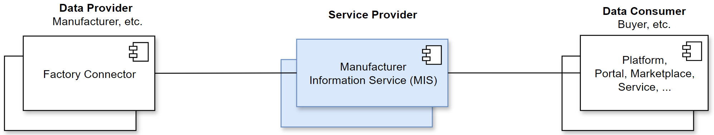
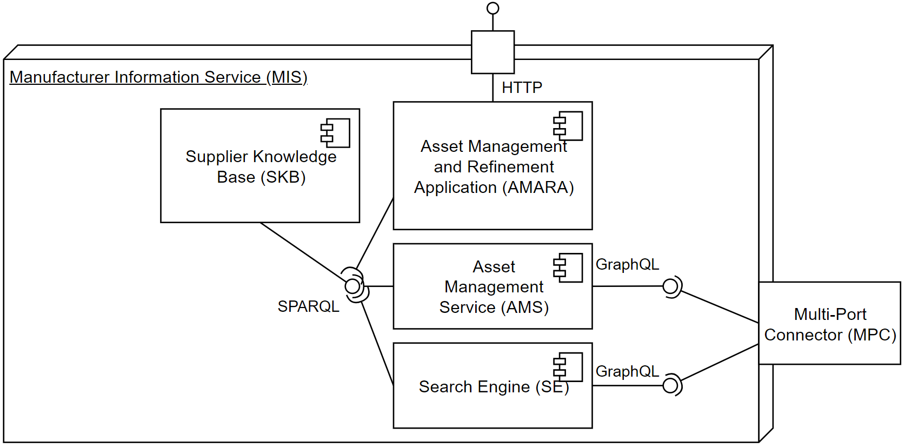

# Manufacturer Information Service (MIS)

The **M**anufacturer **I**nformation **S**ervice **(MIS)** is a modular digital service that provides key modules for the **Manufacturing as a Service (MaaS)** use case.

More information about the MaaS use case :blue_book: [MaaS KIT](https://eclipse-tractusx.github.io/docs-kits/kits/Manufacturing%20as%20a%20Service%20Kit/Adoption%20View%20MaaS%20KIT#usecase--domain-explanation) and [here](https://disc-ecosystem.com/maas-usecase/)

| MIS is still under development. Contributions in form of requirements, issues and pull requests are highly welcome. |
|-----------------------------|

## MIS Overview

The purpose of the MIS is to collect available capability offerings from a set of manufacturers, and to make them discoverable to potential buyers. In that context, the manufacturers are playing the role of a **Data Provider** and their offerings are provided by a _Factory Connector_. The buyers are considered to be a **Data Consumer** of the service provided by the MIS is its role as a **Service Provider**.

## Use Cases of MIS

The following use cases can be performed with the MIS.

1. UC1 **Manual capability registration**
   - Registration of manufacturer capability information via factory connectors.
   - AI-based extraction of manufacturer capability information, based on machine specifications.
2. UC2 **Automatic capability registration / crawling**
   - The manufacturers' production capabilities are automatically read out by querying the factory connectors.
3. UC3 **Requesting manufacturer information**
   - Data consumer can use the MIS to query information such as production capabilities for a data provider.
4. UC4 **Search for potential suppliers/supply chains**
   - Identification of potential suppliers/supply chains for a given production process.

## MIS Architecture

MIS architecture with the functional components.

| Components    | Goals         | URL           |
| ------------- | ------------- | ------------- |
| **Supplier Knowledge Base (SKB)** | Knowledge base for manufacturer/supplier information e.g. capabilities, properties, etc. | [MIS-SKB](https://github.com/FraunhoferIOSB/MIS-SKB)  |
| **Asset Management and Refinement Application (AMARA)**  | Automatically derives manufacturing capabilities from machine specifications with Large Language Models (LLM)  | [MIS-AMARA](https://github.com/FraunhoferIOSB/MIS-AMARA) |
| **Asset Management Service (AMS)**  | Interface to manage asset information like machines, manufacturing capabilities, etc. within the knowledge base |[MIS-AMS](https://github.com/FraunhoferIOSB/MIS-AMS)  |
| **Search Engine (SE)**  | Provision of manufacturer information such as production capabilities for a given process description  | [MIS-SE](https://github.com/FraunhoferIOSB/MIS-SE)  |

## Contributing

Contributions are what make the open source community such an amazing place to learn, inspire, and create. Any contributions are **greatly appreciated**.
You can find our contribution guidelines [here](CONTRIBUTING.md)

## Contact

info-disc-ecosystem@iosb.fraunhofer.de

## License

Distributed under the Apache 2.0 License. See `LICENSE` for more information.

Copyright (C) 2022 Fraunhofer Institut IOSB, Fraunhoferstr. 1, D 76131 Karlsruhe, Germany.

You should have received a copy of the Apache 2.0 License along with this program. If not, see https://www.apache.org/licenses/LICENSE-2.0.html.
